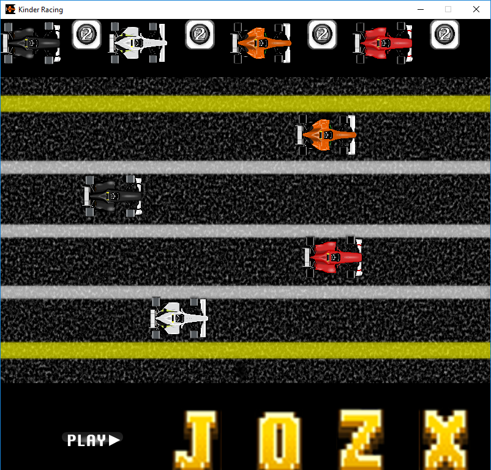

# KinderRacing
##### VERSION 0.9.1 - Beta
Created by Nolan Melander

## About

Kinder Racing is a simple game to help children in preschool and kindergarten to recognize the sound of letters.

## Update Change
* New Question Algorithm increase questions from 26 to 15,600
* Minor Bug Fixes

## Known Bugs
* Holding down the key of a correct answer allows vehicles to move until the key is released

## Future Features

These features are planned for a future version

* Recognizing Numbers
* Recognizing Shapes
* Lap Limit
* Adding your own voice to each letter
* Randomizing race car colors

##Game Images

#### Main Menu

#### Game Play
